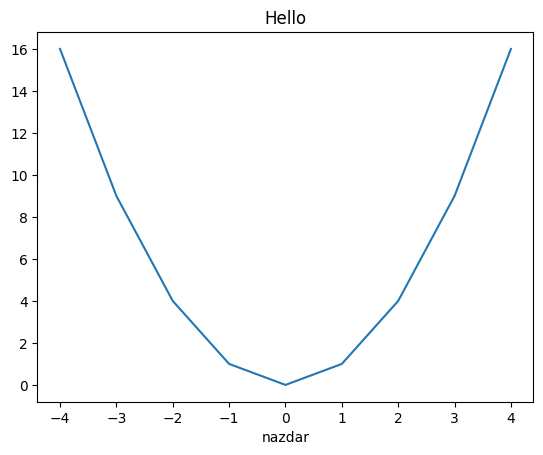

# Lists, Mutability and Cloning

Let's talk about the most important principles of lists and other mutable objects. I also want to mention some common "gotchas".

To be open, this description is based on *how I understand the topic*. In some aspects it differs from what can be found on the internet. I don't know why, but I think most descriptions of a variable on the internet are either incomplete or incorrect. This is how I understand that and what helps me understand lists, mutability and cloning.

## Variables vs. Pointers vs. Objects

This is foundational to understand the whole mutability and cloning thing. As far as I know, variables (or names), pointers (or references) and objects are three *completely different things*.
- Variables live in a namespace. A namespace is a mapping (we can think of it as a `dict`) from *variables* to *pointers*. So a variable is basically a label of a pointer.
- Pointers point to a location in memory. I think of them as memory addreses.
- An object is the actual thing on location in memory.

So, to sum this up, variables map to pointers and pointers map to objects. It is common to think that "variables are just names for objects". Also, I found on the internet the sentences "variables are names associated with concrete objects" or "variable is essentially a name that is assigned to a value". No, that's incorrect. A variable is a name (in a namespace) of a *pointer*. And that pointer points to a location in memory where an object can be found. That object has then a value (along with a type and an identity). But a namespace isn't the only place we can found pointers.

## Lists Only Contain Pointers

Once we understand the differences between varaibles, pointers and objects, now comes the most important part: lists only contain pointers. Not objects. Not variables. Pointers. A list is internally basically an array, where each item in the array is a pointer to a memory location.

The pointer, as an element of a list, can be created either implicitely, or explicitely. If we type `L = ['a']`, this is what I call an implicit creation of a pointer. Internally, two new objects are created at two different memory locations: The string `'a'` and a new list. A pointer to the string `'a'` is placed as the first element of the new list. And a pointer to the new list is placed in the current namespace and is assigned the label `L`.

Or, we can place a pointer as an element of a list explicitely. That would look like this:
```
A = 'a'
L = [A]
```
First, a new object (the string `'a'`) is created in memory and its pointer is placed to the current namespace with the label `A`. Second, a new list is created, its first element is the pointer that is named `A` and a pointer to this new list is placed to the namespace under the name `L`.

## Mutation

Mutation is the ability of some python objects (types of objects) to change. Numbers, strings or tuples are examples of immutable types. Once objects of these types are created, they cannot be changed. Any pointers that point to such objects will always point to the same unchanged objects.

Examples of mutable types are lists, dictionaries or sets. After they are created, they can be changed (extended, shortened, changed elements etc.). If multiple pointers point to such an object, the change made via one pointer is visible via all other pointers:


```python
L1 = []
L2 = [L1, 'abc']
L1.append(1)
print(L2)
```

    [[1], 'abc']
    

In this example, the list `L2` has two pointers to it: One is the variable `L1` and the other is the first element of the list `L2`. Both places, the varaible and the first element of `L2`, contain the same memory address - the one where `L1` is located. A change made using the variable `L1` is visible through `L2`.

## Self-Referencing

I learned this only after many years of using Python and it blew my mind. Lists contain pointers, ok. But there are not limitations on those pointers. In particular, nothing prevents a list to cointain a pointer to itself:


```python
L1 = ['abc']
L1.append(L1)
print(L1)
```

    ['abc', [...]]
    

In this example, the second element of the list `L1` is a pointer that points to memory location where the list `L1` is located. The interactive python shell has a particular way of letting you know this once you try to print that list: It prints the string '[...]' as the second element of the list, where the pointer to itself is. Surprisingly, one can normally iterate over that list:


```python
for i in L1:
    print(i)
```

    abc
    ['abc', [...]]
    

## Common Gotchas

There are two gotchas I want to mention here, both from my favorite textbook "Introduction to Computation and Programming Using Python" (I have to manage the references in some more methodical way than just typing the whole long name each time...), pages 98 and 99.

### 1) The repetition operator `*`


```python
L1 = [[]]*2
L2 = [[], []]
for i in range(len(L1)):
    L1[i].append(i)
    L2[i].append(i)
print(f'{L1 = }, {L2 = }')
```

    L1 = [[0, 1], [0, 1]], L2 = [[0], [1]]
    

Here, the repetition operator creates a sequence where *the very same object* is repeated n times. In this example, `L1` is a list of two pointers that are the same (they both point to the same empty list). Whereas the list `L2` is made of two different pointers (each is pointing to a different empty list).

### 2) Default values


```python
def append_val(val, list_1 = []):
    list_1.append(val)
    print(list_1)

append_val(3)
append_val(4)
```

    [3]
    [3, 4]
    

The objects to be used as default values are created at a function definition time. And a pointer to this one object is bound to `list_1` each time the function is called without the second parameter.

We can test the "default value is created at a function definition time" claim like this. The string `'here!'` is not printed until the function `append_val` is defined. And that function is not defined until the default value of `param2` is created and that value is not created until the function `long_computation` finishes creating it.


```python
def long_computation():
    x = 0
    for i in range(int(1e10)):
        x += 0

def append_val(val, list_1 = [], param2 = long_computation()):
    list_1.append(val)

print('here!')
```

## Cloning

I'm not sure about the exact terminology here. Does "cloning" refer to only shallow copy or both shallow and deep copy? Anyway, I will try to explicitely state what kind of copy I mean each time.

### Immutable Types

As a preface, I think we only talk about "copying" in connection with mutable types. But here I think it is interesting to look at this behavior of immutable types:


```python
print(id('abc'))
print(id('abc'))
print('-------')
print(id(2))
print(id(2))
print('-------')
print(id(True))
print(id(True))
print('-------')
print(id(None))
print(id(None))
print('-------')
print(id(range(10)))
print(id(range(10)))
print('-------')
print(id(3.14))
print(id(3.14))
print('-------')
print(id((2,)))
print(id((2,)))
```

    1640577203152
    1640577203152
    -------
    140710899286984
    140710899286984
    -------
    140710898401712
    140710898401712
    -------
    140710898401776
    140710898401776
    -------
    1640673096160
    1640673096160
    -------
    1640673251568
    1638533141008
    -------
    1640676037040
    1640674705520
    

I'm not 100% sure if I can generalize like this, but I will :).
1) All instances of `str`, `int`, `bool` and `NoneType` and `range` types that have the same value are the same object.
2) Instances of `float` and `tuple` types, even if they have the same value, are different objects.

BUT, this surprisingly yields `True`:


```python
print(id((2,)) == id((2,)))
```

    True
    

I guess it means that the same tuples created in a single expression are the same object, but tuples created in different expressions are different objects... But I honestly don't know.

Similarly, two `float` instances that actually represent the same integer are the same object when created in a single expression, but different object when created individually:


```python
print(id(float(2)))
print(id(float(2)))
print(id(float(2)) == id(float(2)))
```

    1640673251568
    1640673251440
    True
    

Anyway, back to cloning. Of mutable types. There are two basic versions of cloning, a shallow copy and a deep copy. Again, the examples here are from my already mentioned favorite textbook, pages 101 and 102.

### Shallow Copy

Recall that a list is just an array of pointers. A shallow copy is simply a new list (a new object) that contains the same pointers.

A shallow copy of a list `L` can be obtained by:
- slicing (`L[:]`)
- using the `list` method `copy` (`L.copy()`)
- using list comprehension (`[e for e in L]`)
- using the `list` constructor (`list(L)`)
- or using the generic `copy` method of the `copy` module (`copy.copy(L)`).

Remember, it would be just a copy of the pointers. If objects that those pointers point at are mutable, any changes made to the objects via the old list are visible in the new list.


```python
L = [2]
L1 = [L]
L2 = L1[:]
L.append(3)
print(f'{L1 = }, {L2 = }')
```

    L1 = [[2, 3]], L2 = [[2, 3]]
    

### Deep Copy

If we have a list whose elements are mutable, we might want to copy the list in such a way that changes via the old list do not propagate to the new list - in other words, we might want not only to copy the list, but also its elements. This is what the function `deepcopy` of the module `copy` does:


```python
import copy
```


```python
L = [2]
L1 = [L]
L2 = copy.deepcopy(L1)
L.append(3)
print(f'{L1 = }, {L2 = }')
```

    L1 = [[2, 3]], L2 = [[2]]
    

Here, `L2` is not affected by the mutation of `L`, because `L2` doesn't contain anymore the object to which `L` points. It contains its copy. I'm not sure about the exact internal mechanics, but I imagine the `deepcopy` function does this: It goes to `L1` and makes a shallow copy of it. It then goes to each element in that new list, copies the object to which the element points (creates new such object at a different memory location) and replaces the pointer in the new list with a pointer to this new object. It does that "all the way to the bottom", meaning if an element of the list being copied is another list, its deep copy is also created:


```python
L = [2]
L1 = [[L]]
L2 = copy.deepcopy(L1)
L.append(3)
print(f'{L1 = }, {L2 = }')
```

    L1 = [[[2, 3]]], L2 = [[[2]]]
    

There are two subtleties to be mentioned here. First, if the list to be copied is self-referencing, the `deepcopy` function somehow notices it and replicates the structure in the new list. Second, if two elements of the old list contain the same pointer, the object this pointer points to is copied only once and the new pointer is used twice in the new list. In other words, also this structure is maintained.


```python
L1 = ['abc']
L1.append(L1)
print(L1, id(L1), id(L1[-1]))
L2 = copy.deepcopy(L1)
print(L2, id(L2), id(L2[-1]))
```

    ['abc', [...]] 1640674902656 1640674902656
    ['abc', [...]] 1640674911232 1640674911232
    


```python
L = ['abc']
L1 = [L, L]
L2 = copy.deepcopy(L1)
L2[0].append(2)
print(L2)
```

    [['abc', 2], ['abc', 2]]
    


```python
from matplotlib import pyplot as plt
```


```python
plt.plot([i for i in range(-4, 5)], [i**2 for i in range(-4, 5)])
plt.title('Hello')
plt.xlabel('nazdar')
```


    Text(0.5, 0, 'nazdar')


    

    


```python

```
